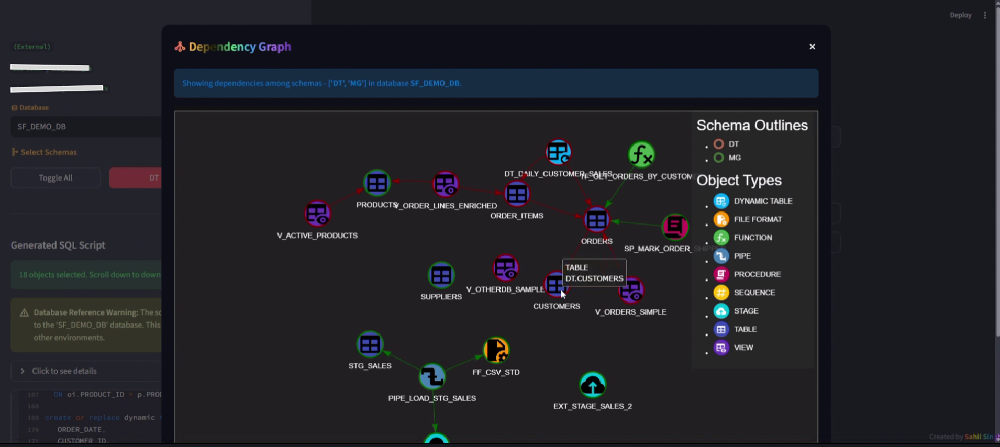

# Snowflake DDL Extractor

A Streamlit-based web application for extracting, parsing, and downloading Data Definition Language (DDL) scripts from Snowflake databases and visualize object dependencies.

## Overview

This tool allows users to connect to Snowflake, browse database objects (e.g., schemas, tables, views), visualize dependencies, and generate exportable SQL scripts with topological ordering based on object dependencies.

The app supports both in-browser (external) and Snowsight-integrated (Snowflake-native) modes, handles authentication (basic, key-based, SSO), and provides features like search, hierarchical selection, and warnings for database-specific references with DDL.

## Features

- **Snowflake Integration**: Secure login with support for basic authentication, private key pairs, or SSO. If running directly in Snowflake Snowsight, the app auto-detects the session and skips manual login.
- **Database Browsing**: List databases, schemas, and objects with hierarchical checkboxes for selection.
- **Dependency Management**: Automatically detects and topologically sorts object dependencies (e.g., views depending on tables).
- **Visualization**: Interactive dependency graph using PyVis to show relationships between objects.
- **DDL Export**: Parse raw DDLs, remove database-specific references (for Create statement), and download a consolidated SQL script, useful for deployments.
- **Search and Filtering**: Filter objects by name and select schemas via sidebar.
- **Warnings and Insights**: Detects hardcoded database references in DDL and provides snippets for review.
- **State Management**: Preserves selections and states across interactions for a smooth user experience.
- **Easy-to-Use Interface:** A simple and intuitive UI built with Streamlit.

## Installation

1. **Clone the Repository or Download**:

   [sf-ddl-extractor-streamlit](https://github.com/SahilSinnh/sf-ddl-extractor-streamlit.git)

   ```bash
   git clone https://github.com/SahilSinnh/sf-ddl-extractor-streamlit.git
   ```
   Move to the project folder in terminal
   ```bash
   cd sf-ddl-extractor-streamlit
   ```

2. **Install Dependencies**:
   Ensure you have Python 3.11+ installed. Install the required packages in your Python environment:
   ```bash
   pip install -r requirements.txt
   ```
   - Note: This includes `streamlit`, `snowflake-snowpark-python`, `pyvis`, and `cryptography`.

3. **Snowflake Setup**:
   - You need a valid Snowflake account with appropriate roles/permissions to access databases and execute `SHOW` and `GET_DDL` commands.
   - For key-based authentication, prepare a PEM-formatted private key file or content.

## Usage

1. **Run the Application**:
   ```bash
   streamlit run src/app.py
   ```
   - This launches the app in your browser (default: http://localhost:8501).
   - If running in Snowflake Snowsight, the app auto-detects the session and skips manual login.

2. **Login** (External only):
   - If not in Snowsight, enter your Snowflake credentials (account, user, warehouse, role).
   - Choose authentication method: Basic (username/password), Key-Based (PEM key), or SSO (external browser).

3. **Select Database and Schemas**:
   - Choose a database from the sidebar dropdown.
   - Select schemas to filter and display objects.

4. **Browse and Select Objects**:
   - View objects grouped by schema and type (e.g., tables, views).
   - Use search to filter by name.
   - Checkboxes allow bulk selection (global, per-schema, or individual).

5. **Visualize Dependencies**:
   - Click the "Dependency Graph" button to open an interactive graph dialog.
   - Nodes represent objects with icons and colors; edges show dependencies.

6. **Generate and Download DDL Script**:
   - Section "Generate DDL Script" displays a topologically ordered SQL file.
   - Review warnings for database references.
   - Download the `.sql` file via the button.

7. **Logout** (External Mode Only):
   - Use the sidebar button to close the session.

## ScreenGrabs

- Usage Demo: 
- Login Screen: 
- Object Browser: 
- Dependency Graph: 

## Architecture Overview
<pre>
 <b>sf-ddl-extractor-streamlit</b> /
├──  <b>src/</b>
│   ├──  <b>app.py</b>: <i>Main Streamlit entry point; handles UI, state, and orchestration.</i>
│   └──  <b>utils/</b>
│       ├──  <b>login_ui.py</b>: <i>Manages login form and authentication logic.</i>
│       ├──  <b>snowflake_utils.py</b>: <i>Snowflake interactions (e.g., listing databases, fetching DDLs).</i>
│       ├──  <b>sql_parser.py</b>: <i>Parses DDL text into structured objects, handles quoting and splitting.</i>
│       ├──  <b>dependencies.py</b>: <i>Implements topological sorting for object dependencies using Kahn's algorithm.</i>
│       └──  <b>graph_utils.py</b>: <i>Generates interactive dependency graphs with PyVis.</i>
├──  <b>assets/</b>
│   └──  <b>icons/</b> : <i>SVG icons for different objects, to be used in visualization graph.</i>
│       └── <b>...</b>
├──  <b>requirements.txt</b>: <i>Python dependencies.</i>
├──  <b>environment.yml</b>: <i>Dependencies for Snowflake's Streamlit environment [Used for publishing in Snowflake].</i>
├──  <b>.gitignore</b>: <i>Standard ignores for Python/Streamlit project.</i>
├──  <b>README.md</b>: <i>Standard README file with description, setup, usage, and architecture of project.</i>
└──  <b>LICENSE</b>: <i>A permissive open-source MIT license for the code.</i>
</pre>


The app uses Snowflake's Snowpark for queries and maintains session state for efficiency.

## Limitations

- Does not support some uncommon Snowflake object types, generally not available in GET_DDL function.
- Cannot generate Stage DDL with URL and credentials.
- Dependency detection relies on regex parsing of DDLs; may miss complex or dynamic references.
- No support for installing additional packages at runtime (uses pre-installed libraries).
- Tested primarily with Snowflake's standard DDL output; custom extensions may require adjustments.

## Troubleshooting

- **Login Errors**: Ensure your Snowflake account identifier is correct (e.g., `myorg-myaccount`). For SSO, allow pop-ups.
- **No Objects Shown**: Check role permissions; the app uses `SHOW` and `GET_DDL`.
- **Graph Not Loading**: Ensure PyVis is installed; try refreshing.
- **Performance**: For large databases, fetching DDLs may take time—caching is used where possible.

## Contributing

Contributions welcome! Fork the repo, create a branch, and submit a pull request. Focus on bug fixes, new object types, or UI enhancements.

## License

MIT License. See [LICENSE](LICENSE) for details.