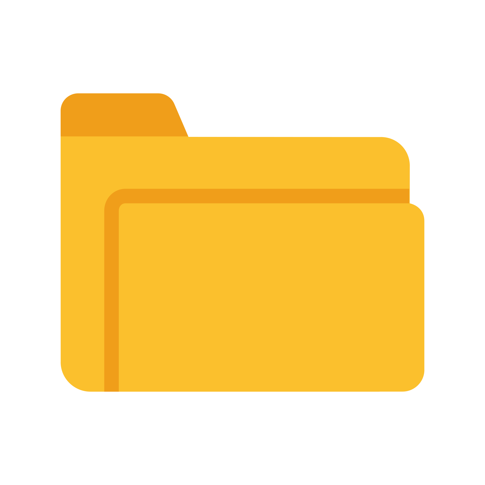

# SnowDL Genie

<a href="https://www.python.org/">
  
</a>
<a href="https://streamlit.io/">
  
</a>
<a href="https://www.snowflake.com/">
  
</a>
<a href="https://opensource.org/licenses/MIT">
  
</a>

A Streamlit web application designed to connect to your Snowflake account and effortlessly pick and extract Data Definition Language (DDL) statements, visualize object dependencies, and generate SQL snippets for various database objects.

## ✨ Features

This application provides a user-friendly interface to:

- **Connect to Snowflake:**
  - Securely connect using Snowflake credentials. Supports basic authentication, private key pairs, or SSO (Single Sign-On). If running directly in Snowflake UI / Snowsight, the app auto-detects the session and skips manual login.
- **Database and DDL Browsing for a wide range of objects**: List databases, schemas, and objects with hierarchical checkboxes for selection.
- **Interactive UI:**
    - A simple and intuitive UI built with Streamlit.
    - A clean, tabbed interface to easily navigate between different object types.
    - A dedicated sidebar for managing your Snowflake connection config like Warehouse, Roles, etc.
    - A SQL block with objects DDL with "Download" or "Copy to Clipboard" to get the SQL snippet.
- **Dependency Visualization**: 
    - Automatically detects and topologically sorts object dependencies (e.g., views depending on tables).
    - Interactive dependency graph using PyVis to show relationships between objects.
- **Chatbot Assistant:**
    - DDLee, An integrated chatbot, using Cortex AI, to help you with your light queries about the application.
- **DDL Export**: Parse raw DDLs, remove database-specific references (for Create statement), and download a consolidated SQL script, useful for deployments.
- **Search and Filtering**: Filter objects by name and select schemas via sidebar.
- **Warnings and Insights**: Detects hardcoded database references in DDL and provides snippets for review.
- **State Management**: Preserves selections and states across interactions for a smooth user experience.

## 🚀 Getting Started

### Prerequisites

- Python 3.9 or higher
- A Snowflake account

### Installation

1.  **Clone the repository or Download ZIP:**
    
    [sf-ddl-extractor-streamlit](https://github.com/SahilSinnh/sf-ddl-extractor-streamlit.git)

    ```bash
    git clone https://github.com/SahilSinnh/sf-ddl-extractor-streamlit.git
    ```
    Move to the project folder in terminal
    ```bash
    cd sf-ddl-extractor-streamlit
    ```

2.  **Install the dependencies:**
    You can install the required packages using either `pip` or `conda`.

    - **Using `pip`:**
      ```bash
      pip install -r requirements.txt
      ```
    - **Using `conda`:**
      ```bash
      conda env create -f environment.yml
      conda activate sf-ddl-extractor-streamlit
      ```
    - Note: This includes `streamlit`, `snowflake-snowpark-python`, `pyvis`, and `cryptography`.

3. **Snowflake Setup**:
    - You need a valid Snowflake account with appropriate roles/permissions to access databases and execute `SHOW` and `GET_DDL` commands.
    - For key-based authentication, prepare a PEM-formatted private key file or content.

### Running the Application

Once the dependencies are installed, you can run the Streamlit app with the following command:

```bash
streamlit run src/app.py
```

  - This launches the app in your browser (default: http://localhost:8501).
  - If running in Snowflake Snowsight, the app auto-detects the session and skips manual login.

## ⚙️ Configuration


## 📖 How to Use

1.  **Connect to Snowflake:** (External only)
    - The application requires you to connect to your Snowflake account.
    - **Authentication Method:** Choose between "Credentials" and "Key/Passphrase".
    - **Credentials:** Enter your Snowflake `username`, `authentication method`, `password` (Basic), `private key` (Key-Pair), `SSO` (No credentials required to enter), `account`, `role` (optional, if set default role ins Snowflake) and `warehouse` (optional, if set default warehouse in Snowflake).
2.  **Select Database:** 
    - Once connected, use the sidebar to select a database from the dropdown you want to inspect.
3.  **Choose an Object:** 
    - Select all or specific schemas/objects from the displayed objects panel.
4. **Generate and Download DDL Script**:
   - Section "Generate DDL Script" displays a topologically ordered SQL snippet, with DDLs for the selected objects.
   - Review warnings for database references.
   - You can use the "Copy" button to copy it to your clipboard, or
   - Download the `.sql` file via "Download" button to save it locally.
5.  **Visualize Dependencies:** 
    - Click the "Dependency Graph" button to open an interactive graph dialog with Legend.
    - Nodes represent objects with icons and colors; edges show dependencies.
6.  **AI Chatbot - DDLee:** 
    - Interact with DDLee, you local lightweighted bot to get answers to some queries around the objects. 
    - Manage chat and context settings with interactive popover panel.
7.  **Logout** (External Mode Only):
   - Use the sidebar button to close the session and clear state.
8.  **Info Panel**:
   - Use the info panel to get information about the app and current session.
   - You can also refresh the app from a refresh button.


## Project Structure

<pre>
 <b>sf-ddl-extractor-streamlit</b> /
├──  <b>src/</b>
│   ├──  <b>app.py</b>: <i>Main Streamlit entry point; handles UI, state, and orchestration.</i>
│   └──  <b>utils/</b>
│       ├──  <b>about.md</b>: <i>Content for the 'About' page.</i>
│       ├──  <b>login_ui.py</b>: <i>Manages login form and authentication logic.</i>
│       ├──  <b>snowflake_utils.py</b>: <i>Snowflake interactions (e.g., listing databases, fetching DDLs).</i>
│       ├──  <b>sql_parser.py</b>: <i>Parses DDL text into structured objects, handles quoting and splitting.</i>
│       ├──  <b>dependencies.py</b>: <i>Implements topological sorting for object dependencies using Kahn's algorithm.</i>
│       └──  <b>graph_utils.py</b>: <i>Generates interactive dependency graphs with PyVis.</i>
│       └──  <b>chatbot.py</b>: <i>Chatbot functionality with Cortex AI using your Snowflake access.</i>
├──  <b>assets/</b>
│   └──  <b>icons/</b> : <i>SVG icons for different objects, to be used in visualization graph.</i>
│       └── <b>...</b>
├──  <b>requirements.txt</b>: <i>Python dependencies [pip].</i>
├──  <b>environment.yml</b>: <i>Python dependencies [conda].</i>
├──  <b>.gitignore</b>: <i>Standard ignores for Python/Streamlit project.</i>
├──  <b>README.md</b>: <i>Standard README file with description, setup, usage, and architecture of project.</i>
└──  <b>LICENSE</b>: <i>A permissive open-source MIT license for the code.</i>
</pre>

## Dependencies

  - All the required Python packages are listed in `requirements.txt` and `environment.yml`.

  - The app uses Snowflake's Snowpark for queries and maintains session state for efficiency.

## Limitations

- Does not support some uncommon Snowflake object types, generally not available in GET_DDL function.
- Cannot generate Stage DDL with URL and credentials.
- Dependency detection relies on regex parsing of DDLs; may miss complex or dynamic references.
- No support for installing additional packages at runtime (uses pre-installed libraries).
- Tested primarily with Snowflake's standard DDL output; custom extensions may require adjustments.

## Troubleshooting

- **Login Errors**: Ensure your Snowflake account identifier is correct (e.g., `myorg-myaccount`). For SSO, allow pop-ups.
- **No Objects Shown**: Check role permissions; the app uses `SHOW` and `GET_DDL`.
- **Graph Not Loading**: Ensure PyVis is installed; try refreshing.
- **Performance**: For large databases, parsing DDLs may take time — caching is used where possible.

## Contributing

Contributions welcome! Fork the repo, create a branch, and submit a pull request. Focus on bug fixes, new object types, or UI enhancements.

## License

This project is licensed under the MIT License - see the [LICENSE](LICENSE) file for details.